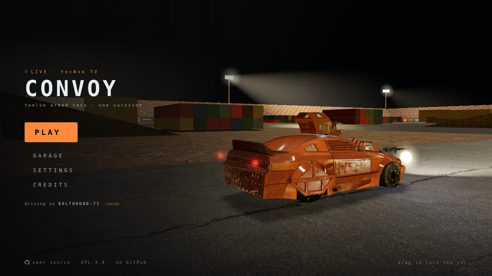

# CONVOY

**Armed cars, a floodlit stadium, a live broadcast — twelve cars, one survivor.**

CONVOY is a vehicle-combat battle royale that runs in the browser. You drive and
shoot at the same time: twin machine guns in the headlights, an RPG on a roof
turret, a closing ring of danger, and eleven other cars that want you gone.
Every match goes out live on *YovNok TV*.



It is free software (GPL-3.0-or-later) and every third-party asset in it is
free to share — see [Assets and licences](#assets-and-licences).

---

## Playing

A desktop browser with WebGL 2 (current Chrome, Edge, Firefox or Safari) and a
**keyboard and mouse** or a **gamepad**. Phones and touch-only tablets show the
title but cannot drive yet.

Press **PLAY**. Bots fill whatever seats players do not, so a match starts
quickly however many people are online, and several matches run at once.

| | Keyboard + mouse | Gamepad |
|---|---|---|
| Throttle · brake / reverse | `W` · `S` | `RT` · `LT` |
| Steer | `A` / `D` | left stick |
| Aim | mouse | right stick |
| Twin machine guns | left click | `RB` |
| Roof RPG | right click | `LB` |
| Handbrake | `Space` | `X` |
| Boost | `Shift` | `B` or `L3` |
| Reload | `R` | `Y` |
| Menu | `Esc` | `Start` (D-pad + `A`/`B` to choose) |
| Performance overlay | `F3` or `` ` `` | — |

**In a match**
- The guns swing ±20° off the nose — aim them mostly by aiming the car. The
  roof RPG turns much further and hits hard, but reloads slowly.
- The ring closes in stages. Outside it, you burn.
- Damage shows: smoke, then black smoke and flames, then a car on fire.
  Repair crates and wreck salvage patch you up if you sit still on them.
- Close or reload the tab mid-match and a bot keeps your car going for 30
  seconds — come back in time and **REJOIN** puts you back behind the wheel.

**Your callsign and paint** live in your browser: pick a callsign under
Settings, and unlock paints in the Garage by playing (matches, kills, wins).
There are no accounts yet.

---

## Running it locally

Requires **Node.js 24** (or newer) and npm.

```bash
npm install
MODE=solo npm run dev
```

Then open **http://localhost:5173**. That starts two processes:

| Process | Port | |
|---|---|---|
| game server | `8787` | the authoritative simulation and WebSocket (`/ws`) |
| Vite | `5173` | the client, proxying `/ws` to the game server |

Useful switches (environment variables for the server):

| Variable | Default | |
|---|---|---|
| `MODE` | `duel` | `solo` is the game as released (one-car teams, bots, the ring) |
| `BOTS` | `fill` in solo | `off`, or a number to fill the field to |
| `SOLO_CARS` | `12` | cars per solo match |
| `MAX_ROOMS` | `8` | simultaneous matches in one process |
| `REJOIN_SECONDS` | `30` | how long a dropped player's car is held |
| `ALLOWED_ORIGINS` | *(any)* | comma-separated origins allowed to open sockets |
| `TRUST_PROXY` | off | `1` behind a reverse proxy (client IP from `X-Forwarded-For`) |

To try a bad connection, add `?lag=120&jitter=40&loss=0.05` to the page URL.

**Production build:** `npm run build && npm start` serves the built client and
the socket from one process on port 8787. Or with the container:
`docker build -t convoy . && docker run -p 8787:8787 -e MODE=solo convoy`.

---

## Tests

```bash
npm run check
```

runs the whole suite — about 400 checks — and the production build:

| | What it guards |
|---|---|
| `typecheck` | TypeScript, strict |
| `licensecheck` | every asset listed, credited and under an allowed licence |
| `assetcheck` | built models against their size and LOD budget |
| `simcheck` | driving physics, collision, the arena's invariants |
| `combattest`, `weapontest` | hit detection, damage, weapons and their mounts |
| `matchtest` | the match lifecycle end to end against a real server |
| `bottest` | bot driving, aiming and weapon discipline |
| `cosmeticstest` | paints and unlocks are look-only; callsign rules |
| `roomstest` | several matches at once, rejoin, and abuse cannot crash the server |
| `netheadless` | client prediction and reconciliation over a real socket |

Diagnostics that are not pass/fail: `npm run solobench` plays real bot matches
and reports match length, accuracy and damage by weapon; `scalebench` and
`driftbench` measure load and handling.

---

## How it is built

- **Client:** TypeScript and [three.js](https://threejs.org) (WebGL 2), built
  with Vite. Models are glTF with meshopt geometry and KTX2 textures.
- **Server:** Node.js and [`ws`](https://github.com/websockets/ws). The server is
  authoritative: it simulates every car at 60 Hz; clients predict their own car
  and reconcile, and draw everyone else slightly in the past, interpolated.
- **Shared:** the simulation, arena, weapons and rules are one codebase used by
  both sides (`src/shared`), so client and server cannot disagree.

```
src/
  shared/   simulation, arena, weapons, match rules, protocol
  server/   rooms (matches), bots, the HTTP + WebSocket server
  client/   rendering, input, camera, audio, HUD and menus
scripts/    tests, benchmarks, and the asset pipeline
assets-src/ source models and textures, with their prep scripts
public/     built assets served to the browser
```

More depth: [DESIGN.md](DESIGN.md) (the game design),
[docs/DEVELOPMENT.md](docs/DEVELOPMENT.md) (architecture, netcode and testing
in detail), [STATE.md](STATE.md) (the running log of what was built and why),
[ASSET_SPEC.md](ASSET_SPEC.md) (the asset pipeline) and
[DEPLOY.md](DEPLOY.md) (hosting).

---

## Assets and licences

The code is **GPL-3.0-or-later** — see [LICENSE](LICENSE).

Third-party assets are used only under **CC0**, **CC-BY** or **CC-BY-SA**
(never non-commercial or no-derivatives), each credited with its author,
source and licence in [ASSETS.md](ASSETS.md) and in the game's **Credits**
screen. `npm run licensecheck` fails the build if anything is unlisted,
uncredited or under another licence. Models come from Poly Haven (CC0) and
Sketchfab (CC-BY); music from Kevin MacLeod (CC-BY); sound effects from
OpenGameArt (CC0 / CC-BY-SA).

Sponsor names in the arena are fictional.

---

## Contributing

Issues and pull requests are welcome. Run `npm run check` before opening a pull
request; new assets must be added to `assets.json` with their licence, or the
build will refuse them.
